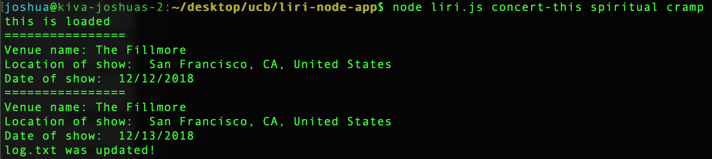
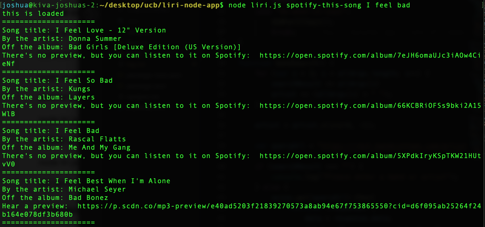
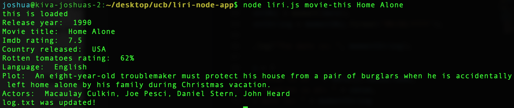

# liri-node-app
LIRI is a _Language_ Interpretation and Recognition Interface. LIRI will be a command line node app that takes in parameters and gives you back data.

# Instructions
To use this application run one of the following commands on the command line:

node liri.js concert-this {BAND NAME}

node liri.js spotify-this-song {SONG NAME}

node liri.js movie-this {MOVIE NAME}

### These command return the following: 

node liri.js concert-this {BAND NAME}

node liri.js spotify-this-song {SONG NAME}

node liri.js movie-this {MOVIE NAME}

